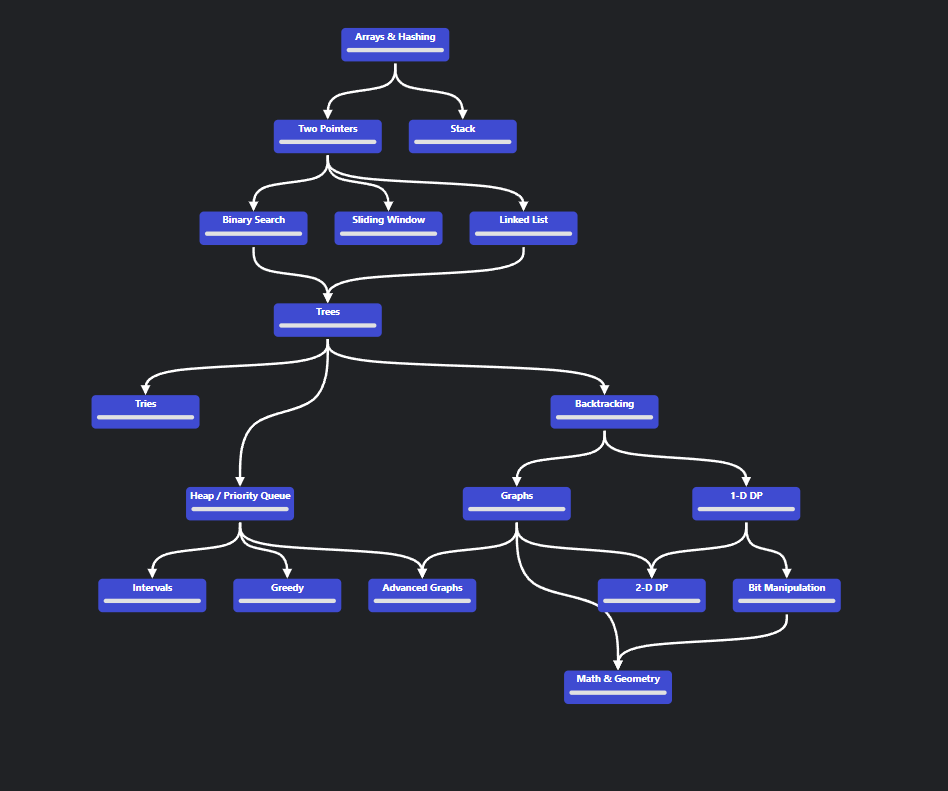

# NeetCode Practice

Solutions to NeetCode problems and study plans. Multiple languages will be used. Links to problems are included in each file.
Some solutions are not direct problems, but problem-adjacent (i.e. implementing something that's abstracted in the problem, etc.)
Most of the folders here corresponding to *things* that exist on NeetCode that I've never done. Fill them in eventually.

Note: the courses may be good (idk), but I won't be using them much. I'll be using NeetCode as just a better form of LeetCode for practice problems.
