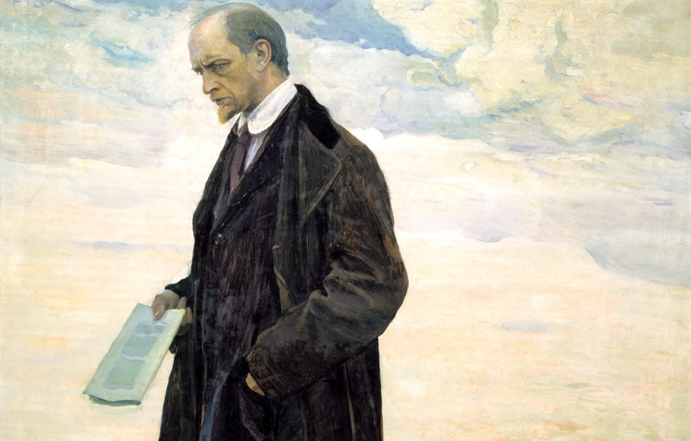

# Contests

## This repository contains *some* of the sources that I've used to practice DSA. Feel free to use this as a reference

The goal is to spend at least 30 minutes every single day practicing. No days off. No cheats. Won't *push* to this repo every day though.

### Complete/Incomplete Status Marked at/near the top of every file

If ever unmarked, that means incomplete

Effort has been made place the link/resource at the top of each file.
Each folder contains README with basic information.
This repo is mainly for storing references and for me to track what I'm working on, know, and still need to improve on.

## So Far, This repo includes

### UWaterloo

- CCC Junnior
- CCC Senior

With contests being ordered by year.

### LeetCode

- LC-75, DFS, BFS, Stack
- Pandas50, SQL50, 30 Days Pandas, 30 Days JS

### NeetCode

A variety of problems following the Roadmap.

### Python-Practice

- Random Python code for practice, and OOP practice.

### HackerRank

- DSA and coding challenges.

Only includes Python so far.

### Misc

- Random stuff I thought to implement while practicing. Things like sorting algorithms, data structures, etc. from scratch. Often in Python but sometimes in C++.

---

New resources will be added here as I find/use them.
`*Note:` Many folders are straight up just boilerplate right now. More will be added as I continue practicing.
